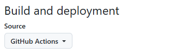

# 搭建博客
## 环境准备
### 安装Zensical
选择一个合适的位置，创建项目目录，进入目录，终端执行:
```python
uv init
uv venv
uv add --dev zensical
```
### 创建项目
```python
# 激活虚拟环境
.venv\Scripts\activate
# 创建新项目
zensical new .
```

### 常用命令
```python
# 启动开发服务器
zensical serve

# 构建
zensical build --clean
```

## 部署
### Github Pages
#### 自动部署
1. 开启自动部署，`Build and deployment/Souce` 选择 `Github Actions`


2. 设置Actions权限, `Actions/General`


## Content Tabs && Code Blocks

### 代码复制按钮
```toml title="zensical.toml"
[project.theme]
features = [
    "content.code.copy"
]
```

> [Content Tabs](https://zensical.org/docs/authoring/content-tabs/)

> [Code Blocks](https://zensical.org/docs/authoring/code-blocks/)

=== "Python"

    ```python linenums="1" hl_lines="2"
    def bubble_sort(items):
        for i in range(len(items)): # (1)!
            for j in range(len(items) - 1 - i):
                if items[j] > items[j + 1]:
                    items[j], items[j + 1] = items[j + 1], items[j]
    ```

    1.  :man_raising_hand: 这是代码注解，注意注解要和(```python)左对齐才能识别

=== "Lua"

    ```Lua linenums="10" hl_lines="1-3"
    local function hello()
        print("Hello Lua!")
    end
    ```

### 输出Markdown格式代码
````markdown title="Markdown Code block"
```python
def hello():
    print("Hello,Python!")
```
````

## Icons, Emojis
### 包含的图标集

- :simple-lucide: - [Lucide]
- :material-material-design: – [MaterialDesign]
- :fontawesome-brands-font-awesome: – [FontAwesome]
- :octicons-mark-github-16: – [Octicons]
- :simple-simpleicons: – [SimpleIcons]


还可以[自定义图标集](https://zensical.org/docs/setup/logo-and-icons/#additional-icons)

## Data Tables
=== "Left"

    ``` markdown hl_lines="2" title="Data table, columns aligned to left"
    | Method      | Description                          |
    | :---------- | :----------------------------------- |
    | `GET`       | :lucide-check:       Fetch resource  |
    | `PUT`       | :lucide-check-check: Update resource |
    | `DELETE`    | :lucide-x:           Delete resource |
    ```

    <div class="result" markdown>

    | Method      | Description                          |
    | :---------- | :----------------------------------- |
    | `GET`       | :lucide-check:       Fetch resource  |
    | `PUT`       | :lucide-check-check: Update resource |
    | `DELETE`    | :lucide-x:           Delete resource |

    </div>

=== "Center"

    ``` markdown hl_lines="2" title="Data table, columns centered"
    | Method      | Description                          |
    | :---------: | :----------------------------------: |
    | `GET`       | :lucide-check:       Fetch resource  |
    | `PUT`       | :lucide-check-check: Update resource |
    | `DELETE`    | :lucide-x:           Delete resource |
    ```

    <div class="result" markdown>

    | Method      | Description                          |
    | :---------: | :----------------------------------: |
    | `GET`       | :lucide-check:       Fetch resource  |
    | `PUT`       | :lucide-check-check: Update resource |
    | `DELETE`    | :lucide-x:           Delete resource |

    </div>

=== "Right"

    ``` markdown hl_lines="2" title="Data table, columns aligned to right"
    | Method      | Description                          |
    | ----------: | -----------------------------------: |
    | `GET`       | :lucide-check:       Fetch resource  |
    | `PUT`       | :lucide-check-check: Update resource |
    | `DELETE`    | :lucide-x:           Delete resource |
    ```

    <div class="result" markdown>

    | Method      | Description                          |
    | ----------: | -----------------------------------: |
    | `GET`       | :lucide-check:       Fetch resource  |
    | `PUT`       | :lucide-check-check: Update resource |
    | `DELETE`    | :lucide-x:           Delete resource |

    </div>

## Formatting
### Highlight Text
``` title="Text with highlighting"
- ==This was marked (highlight)==
- ^^This was inserted (underline)^^
- ~~This was deleted (strikethrough)~~
```

<div class="result" markdown>

- ==This was marked (highlight)==
- ^^This was inserted (underline)^^
- ~~This was deleted (strikethrough)~~

</div>

### Sub and superscripts

$$
H_{2}O \
A^{T}A
$$

$$
\cos x=\sum_{k=0}^{\infty}\frac{(-1)^k}{(2k)!}x^{2k}
$$

## 参考
* [Zensical文档](https://zensical.org/docs/get-started/)
* [Zensical中文教程](https://wcowin.work/Zensical-Chinese-Tutorial/getting-started/quick-start/)


[Lucide]: https://lucide.dev/
[MaterialDesign]: https://pictogrammers.com/library/mdi/
[FontAwesome]: https://fontawesome.com/search?m=free
[Octicons]: https://octicons.github.com/
[SimpleIcons]: https://simpleicons.org/

