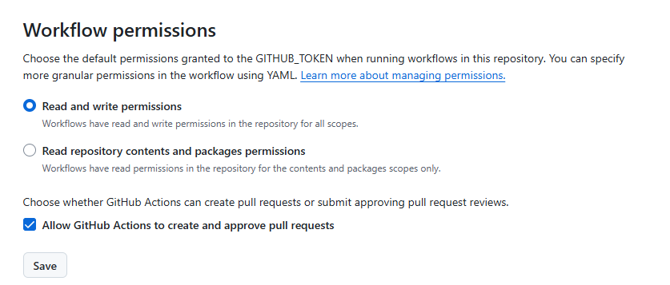

# Zensical搭建博客
## 环境准备
### 安装Zensical
选择一个合适的位置，创建项目目录，进入目录，终端执行:
```python
uv init
uv venv
uv pip install zensical
```
### 创建项目
```python
# 激活虚拟环境
.venv\Scripts\activate
# 创建新项目
zensical new .
```

### 常用命令
```python
# 启动开发服务器
zensical serve

# 构建
zensical build --clean
```

## 部署
### Github Pages
#### 自动部署
1. 开启自动部署，`Build and deployment/Souce` 选择 `Github Actions`


2. 设置Actions权限, `Actions/General`



## 参考
* [Zensical文档](https://zensical.org/docs/get-started/)
* [Zensical中文教程](https://wcowin.work/Zensical-Chinese-Tutorial/getting-started/quick-start/)
